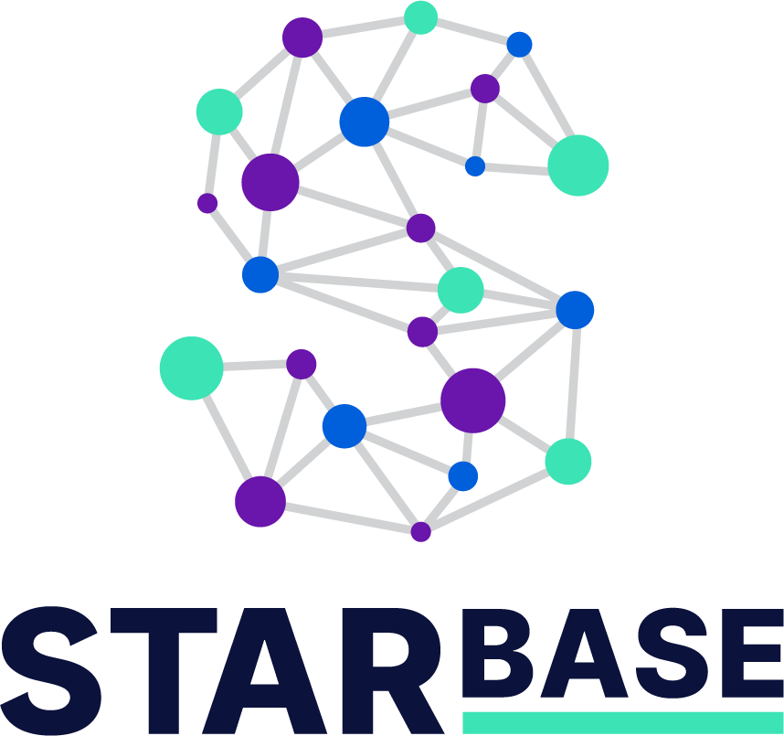
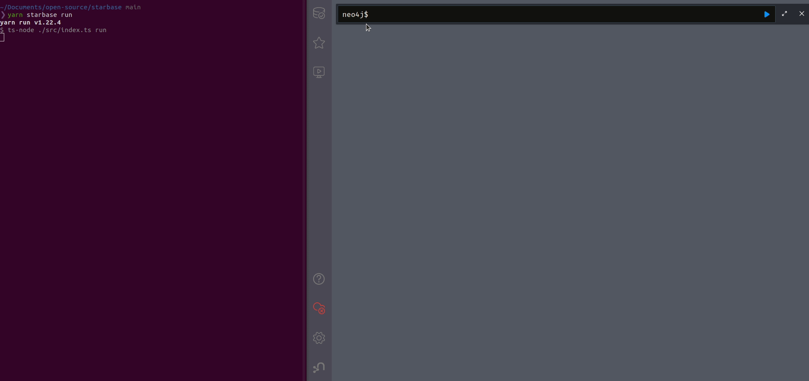

<h1 align="center">
  </br></br>
  <strong style="font-size:75px;">Democratizing graph-based security analysis 🚀</strong>
</h1></br>

Starbase from [JupiterOne](https://jupiterone.com), collects assets and
relationships from services and systems including cloud infrastructure, SaaS
applications, security controls, and more into an intuitive graph view backed by
the [Neo4j](https://neo4j.com/) database.

**Security is a basic right**. Starbase's goal is to **democratize graph-based
security analysis** and overall visibility into external services and systems.
Our team believes that in order to secure any system or service, you must have:

- **Knowledge** of the assets that you have
- **Knowledge** of the relationships between assets that you have
- **Knowledge** of what questions to ask about what you have

<p align="center">
  
</p>

## Why Starbase?

Starbase offers three key advantages:

1. **Depth and breadth** - Deep visibility from a
   [breadth of external services and systems](#available-integrations--connectors).
   Thousands of entities (vertices) and relationships (edges) are available
   out-of-the-box.
2. **Uniform data model** - The data that Starbase collects is _automatically_
   classified, making it easy to develop _generic_ queries.
3. **Easily extensible** - Starbase graph integrations can be easily developed!

## Available Integrations / Connectors

Starbase supports
[70+](https://github.com/jupiterone?q=graph-&type=all&language=&sort=) open
source graph integrations!

Here are some highlights:

- [Azure](https://github.com/jupiterone/graph-azure)
- [Bitbucket](https://github.com/jupiterone/graph-bitbucket)
- [GitHub](https://github.com/jupiterone/graph-github)
- [Google Cloud](https://github.com/jupiterone/graph-google-cloud)
- [Google Workspace](https://github.com/jupiterone/graph-google)
- [Jira](https://github.com/jupiterone/graph-jira)
- ...

<details>
  <summary><b>❗Click here to expand a full list of supported graph integrations❗</b></summary>

- [^1]AWS
- [Addigy](https://github.com/jupiterone/graph-addigy)
- [AirWatch](https://github.com/jupiterone/graph-airwatch)
- [AquaSec](https://github.com/jupiterone/graph-aquasec)
- [JFrog Artifactory](https://github.com/jupiterone/graph-artifactory)
- [atSpoke](https://github.com/jupiterone/graph-atspoke)
- [Auth0](https://github.com/jupiterone/graph-auth0)
- [Azure](https://github.com/jupiterone/graph-azure)
- [Azure DevOps](https://github.com/jupiterone/graph-azure-devops)
- [BambooHR](https://github.com/jupiterone/graph-bamboohr)
- [Bugcrowd](https://github.com/jupiterone/graph-bugcrowd)
- [CbDefense](https://github.com/jupiterone/graph-cbdefense)
- [Checkmarx](https://github.com/jupiterone/graph-checkmarx)
- [Cisco Amp](https://github.com/jupiterone/graph-cisco-amp)
- [Cisco Meraki](https://github.com/jupiterone/graph-cisco-meraki)
- [Cloudflare](https://github.com/jupiterone/graph-cloudflare)
- [Cobalt](https://github.com/jupiterone/graph-cobalt)
- [CrowdStrike](https://github.com/jupiterone/graph-crowdstrike)
- [Datadog](https://github.com/jupiterone/graph-datadog)
- [Detectify](https://github.com/jupiterone/graph-detectify)
- [DigiCert](https://github.com/jupiterone/graph-digicert)
- [Duo](https://github.com/jupriterone/graph-duo)
- [Fastly](https://github.com/jupiterone/graph-fastly)
- [Feroot](https://github.com/jupiterone/graph-feroot)
- [Gitlab](https://github.com/jupiterone/graph-gitlab)
- [Gitleaks Findings](https://github.com/jupiterone/graph-gitleaks-findings)
- [GoDaddy](https://github.com/jupiterone/graph-godaddy)
- [Google](https://github.com/jupiterone/graph-google)
- [Google Cloud](https://github.com/jupiterone/graph-google-cloud)
- [HackerOne](https://github.com/jupiterone/graph-hackerone)
- [Heroku](https://github.com/JupiterOnejupiterone/graph-heroku)
- [HubSpot](https://github.com/JupiterOnejupiterone/graph-hubspot)
- [Jamf](https://github.com/jupiterone/graph-jamf)
- [Jira](https://github.com/jupiterone/graph-jira)
- [JumpCloud](https://github.com/jupiterone/graph-jumpcloud)
- [Knowbe4](https://github.com/jupiterone/graph-knowbe4)
- [Kubernetes](https://github.com/jupiterone/graph-kubernetes)
- [Malwarebytes](https://github.com/jupiterone/graph-malwarebytes)
- [Microsoft 365](https://github.com/jupiterone/graph-microsoft-365)
- [Mimecast](https://github.com/jupiterone/graph-mimecast)
- [Nmap](https://github.com/jupiterone/graph-nmap)
- [NowSecure](https://github.com/jupiterone/graph-nowsecure)
- [NPM](https://github.com/jupiterone/graph-npm)
- [Okta](https://github.com/jupiterone/graph-okta)
- [OneLogin](https://github.com/jupiterone/graph-onelogin)
- [OpenShift](https://github.com/jupiterone/graph-openshift)
- [PagerDuty](https://github.com/jupiterone/graph-pagerduty)
- [Qualys](https://github.com/jupiterone/graph-qualys)
- [Rapid7](https://github.com/jupiterone/graph-rapid7)
- [Rumble](https://github.com/jupiterone/graph-rumble)
- [Salesforce](https://github.com/jupiterone/graph-salesforce)
- [SentinelOne](https://github.com/jupiterone/graph-sentinelone)
- [Sentry](https://github.com/jupiterone/graph-sentry)
- [ServiceNow](https://github.com/jupiterone/graph-servicenow)
- [Signal Sciences](https://github.com/jupiterone/graph-signal-sciences)
- [Slack](https://github.com/jupiterone/graph-slack)
- [Snipe It](https://github.com/jupiterone/graph-snipe-it)
- [Snowflake](https://github.com/jupiterone/graph-snowflake)
- [Snyk](https://github.com/jupiterone/graph-snyk)
- [SonarQube](https://github.com/jupiterone/graph-sonarqube)
- [Sysdig](https://github.com/jupiterone/graph-sysdig)
- [Tenable.io](https://github.com/jupiterone/graph-tenable-io)
- [Terraform Cloud](https://github.com/jupiterone/graph-terraform-cloud)
- [ThreatStack](https://github.com/jupiterone/graph-threatstack)
- [Trend Micro](https://github.com/jupiterone/graph-trend-micro)
- [Veracode](https://github.com/jupiterone/graph-veracode)
- [Vuls Findings](https://github.com/jupiterone/graph-vuls-findings)
- [Wazuh](https://github.com/jupiterone/graph-wazuh)
- [WhiteHat](https://github.com/jupiterone/graph-whitehat)
- [Whois](https://github.com/jupiterone/graph-whois)
- [WP Engine](https://github.com/jupiterone/graph-wpengine)
- [Zendesk](https://github.com/jupiterone/graph-zendesk)
- [Zoom](https://github.com/jupiterone/graph-zoom)
</details>

## Usage and Development

### Prerequisites

1. Install [Node.js](https://nodejs.org/) using the
   [installer](https://nodejs.org/en/download/) or a version manager such as
   [nvm](https://github.com/nvm-sh/nvm) or [fnm](https://github.com/Schniz/fnm).
2. Install [`yarn`](https://yarnpkg.com/getting-started/install).
3. Install dependencies with `yarn install`.
4. Register an account in the system each integration targets for ingestion and
   obtain API credentials.

### Configuring Starbase

Starbase leverages credentials from external services to authenticate and
collect data. When Starbase is started, it reads configuration data from a
single configuration file named `config.yaml` at the root of the project.

1. Copy `config.yaml.example` to `config.yaml`

```
cp config.yaml.example config.yaml
```

2. Supply configuration values in `config.yaml` for each integration

> **NOTE**: The individual graph integration configuration field names can be
> found in their respective `graph-*` projects.
>
> For example:
> https://github.com/JupiterOne/graph-google-cloud/blob/main/.env.example
>
> The `config.yaml` would resemble the following for Google Cloud:
>
> ```yaml
> integrations:
>   - name: graph-google-cloud
>     instanceId: testInstanceId
>     directory: ./.integrations/graph-google-cloud
>     gitRemoteUrl: https://github.com/JupiterOne/graph-google-cloud.git
>     config:
>       SERVICE_ACCOUNT_KEY_FILE: {}
>       PROJECT_ID: '...'
>       ORGANIZATION_ID: '...'
>       CONFIGURE_ORGANIZATION_PROJECTS: false
> storage:
>   engine: neo4j
>   config:
>     username: neo4j
>     password: devpass
>     uri: bolt://localhost:7687
> ```

### Running Starbase

Starbase exposes a CLI for bootstrapping graph integration development and
execution.

```
❯ yarn starbase --help

Usage: yarn starbase [options] [command]

Starbase graph ingestion orchestrator

Options:
  -h, --help      display help for command

Commands:
  run             collect and upload entities and relationships
  setup           clone repositories listed in config.yaml
  help [command]  display help for command
```

1. Run `yarn starbase setup` to clone or update all integrations listed in the
   `config.yaml` file as well as install all dependencies for each integration.
2. Run `yarn starbase run` to collect data for each listed integration and then
   push collected data to the storage endpoint listed in `config.yaml`.

For additional information on using Neo4j as a storage endpoint, please see the
[README.md](docker/README.md) provided.

### Running Starbase - Docker

Alternatively, Docker can be used to run Starbase, minimizing the need to
locally install node and yarn.

1. Run `docker build --no-cache -t starbase:latest .` to create the Starbase
   docker image.
2. Run `docker-compose run starbase setup` to clone or update all integrations
   listed in the `config.yaml` file as well as install all dependencies for each
   integration.
3. Run `docker-compose run starbase run` to collect data for each listed
   integration and then push collected data to the storage endpoint listed in
   `config.yaml`.

Note that macOS users in particular may see slower execution times when running
Starbase in a Docker container.

### Customizable Base Container Image

We also make a
[base container image available via GitHub Container Registry](https://github.com/jupiterone/starbase/pkgs/container/starbase).
This image has only Starbase installed, without any configuration or graph
integrations. This means you'll need to pass configuration to Starbase by making
your `config.yaml` available to your running container, for example via a
[Kubernetes ConfigMap](https://kubernetes.io/docs/concepts/configuration/configmap/#using-configmaps-as-files-from-a-pod),
and run `starbase setup` to install your graph integrations before using them.

### Contributing

Starbase is composed of three components:

1. **Starbase Core**

   The Starbase core project is an orchestration engine that handles
   bootstrapping the underlying graph integrations.

2. **Graph Integrations**

   These are the tools that perform data collection from third party systems and
   services. You can find a full list of supported
   [graph integrations here](https://github.com/jupiterone?q=graph-&type=all&language=&sort=).
   If you have a feature request, a bug to report, or you'd like to contribute
   to one of the supported integrations, please navigate to the specific
   integration repository.

3. **[Graph Integrations SDK](https://github.com/jupiterone/sdk)**

   The Graph Integration SDK contains core utilities and the underlying graph
   integration runtime packages. See the
   [SDK development documentation](https://github.com/JupiterOne/sdk/blob/main/docs/integrations/development.md)
   for a deep dive into the mechanics of how integrations work.

### Changelog

The history of this project's development can be viewed at
[CHANGELOG.md](CHANGELOG.md).

### Contact

Join us on `#starbase` on the
[JupiterOne Community Slack](https://join.slack.com/t/jupiterone-community/shared_invite/zt-9b0a2htx-m8PmSWMbkjqCzF2dIZiabw).

## JupiterOne

If this is too much work, you can create a free cloud-hosted account at
https://login.us.jupiterone.io/sign-up.

[^1]:
    JupiterOne Starbase and the
    [Lyft Cartography](https://github.com/lyft/cartography) projects complement
    each other as both projects push graph data to a Neo4j database instance. As
    such, users of Starbase can leverage the AWS connector from Cartography to
    ingest AWS assets and relationships. A more comprehensive AWS integration is
    used by the [cloud hosted JupiterOne platform](https://jupiterone.com) and
    we are considering open sourcing the JupiterOne AWS integration in the
    future.
