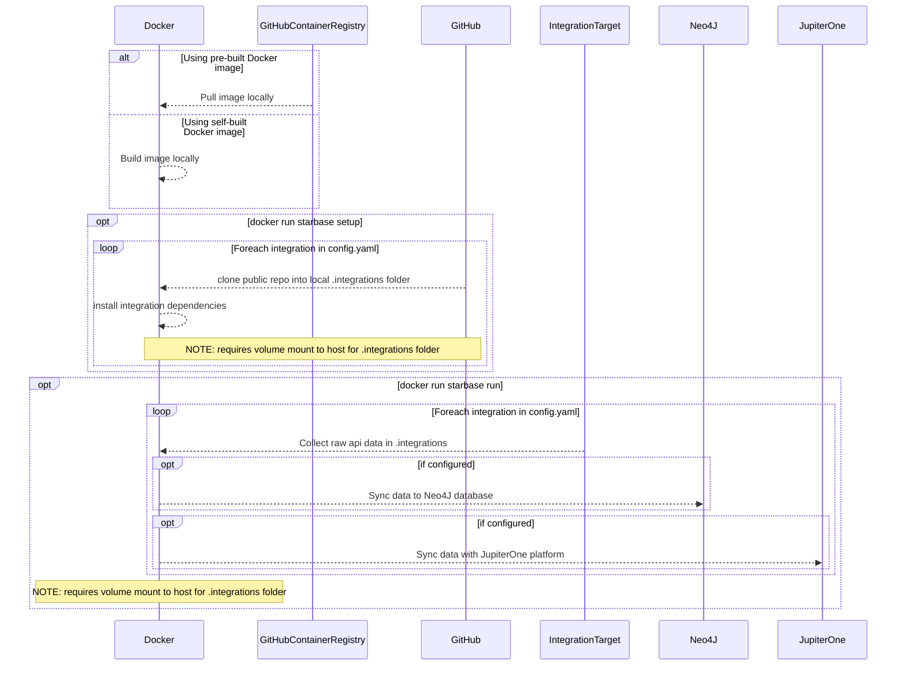

# Starbase in Docker

Starbase can also be run inside of Docker, minimizing the need to locally
install node and yarn.

## Execution Flow Diagram

## Running Starbase - Docker

1. Run `docker build --no-cache -t starbase:latest .` to create the Starbase
   docker image.
2. Run `docker-compose run starbase setup` to clone or update all integrations
   listed in the `config.yaml` file as well as install all dependencies for each
   integration.
3. Run `docker-compose run starbase run` to collect data for each listed
   integration and then push collected data to the storage endpoint listed in
   `config.yaml`.

Note that macOS users in particular may see slower execution times when running
Starbase in a Docker container.

## Customizable Base Container Image

A public
[base container image is available via GitHub Container Registry](https://github.com/jupiterone/starbase/pkgs/container/starbase).
This image only has Starbase installed, without any configuration or graph
integrations. This means you'll need to pass configuration to Starbase by making
your `config.yaml` available to your running container, for example via a
[Kubernetes ConfigMap](https://kubernetes.io/docs/concepts/configuration/configmap/#using-configmaps-as-files-from-a-pod),
and run `starbase setup` to install your graph integrations before using them.
