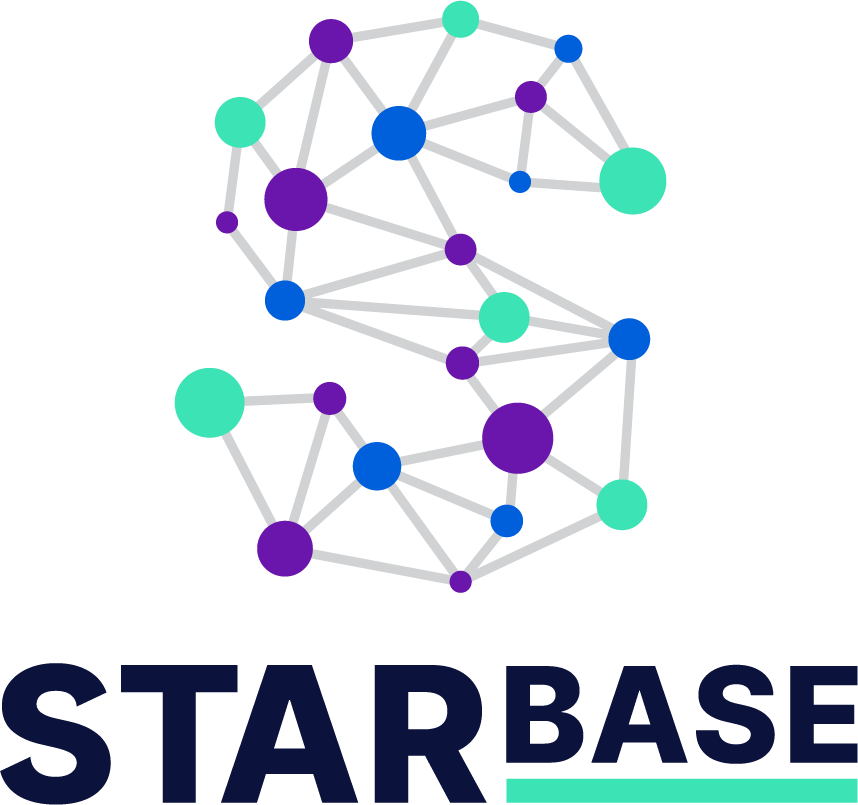
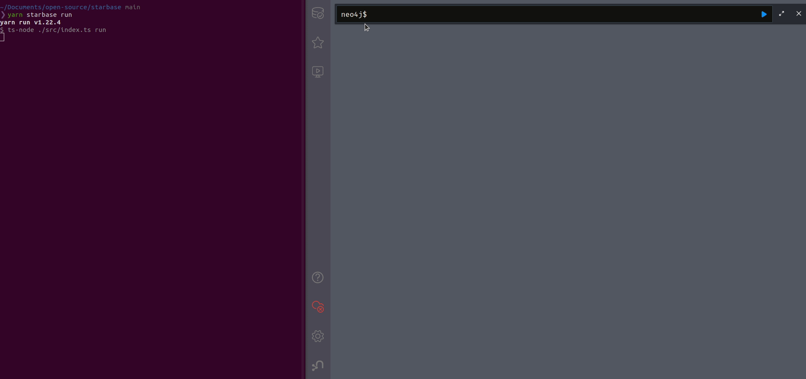

<h1 align="center">
   
  <strong style="font-size:32px;">Democratizing graph-based security analysis 🚀</strong>
</h1>

Starbase from [JupiterOne](https://jupiterone.com), collects assets and
relationships from services and systems including cloud infrastructure, SaaS
applications, security controls, and more into an intuitive graph view backed by
the [Neo4j](https://neo4j.com/) database.

**Security is a basic right**. Starbase's goal is to **democratize graph-based
security analysis** and overall visibility into external services and systems.
Our team believes that in order to secure any system or service, you must have:

- **Knowledge** of the assets that you have
- **Knowledge** of the relationships between assets that you have
- **Knowledge** of what questions to ask about what you have

  

## Why Starbase?

Starbase offers three key advantages:

1. **Depth and breadth** - Deep visibility from a breadth of external services
   and systems.Thousands of entities (vertices) and relationships (edges) are
   available out-of-the-box.
2. **Uniform data model** - The data that Starbase collects is _automatically_
   classified, making it easy to develop _generic_ queries.
3. **Easily extensible** - Starbase graph integrations can be easily developed!
